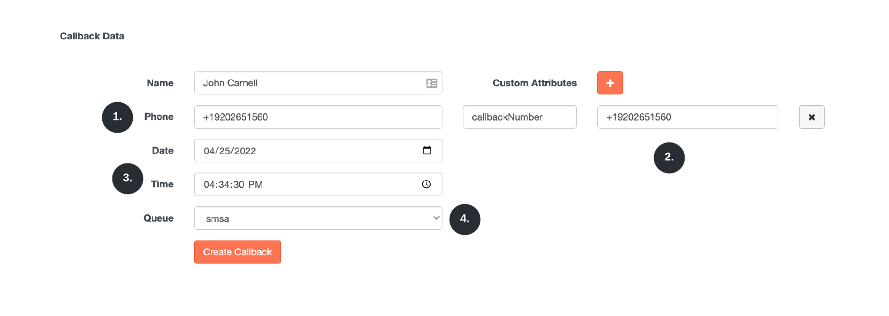
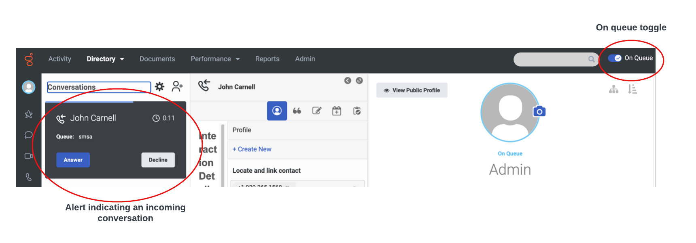
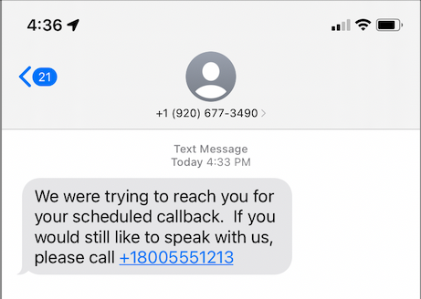

This Genesys cloud blueprint demonstrates how to send an SMS message to a customer when an agent attempts to reach the customer on a callback and the customer is unavailable. All the components in this solution can be deployed using Terraform and the Genesys Cloud CX as Code provider.

:::primary
To implement the solution in this blueprint, you must purchase an SMS number through Genesys Cloud. For more information, see [Purchase SMS long code numbers](https://help.mypurecloud.com/articles/purchase-sms-long-code-numbers/ "Goes to the purchase an SMS phone number page"). You use the number in the Terraform configuration.

::: 


## Scenario

An organization wants to provide a personalized approach to customer service experience. They need to send an SMS message to a customer who has requested a callback and was unavailable when the agent called. To implement the solution, the organization wants to:

* **Schedule a callback to their customer with an agent** The initial scheduled callback is from a customer requesting the organization to contact them at a certain time period or it can be part of a larger callback campaign. The callback must go into a queue at its scheduled time.

* **Notify the agent to reach the customer** The agent receives an incoming notification of a callback and attempts to contact the customer.

* **Customer is unavailable** The agent fails to reach the customer. The agent selects a wrap-up code that indicates the customer unavailability and ends the conversation.

* **Genesys Cloud publishes a business event which indicates the end of conversation** A process automation trigger checks whether the incoming event matches a set of predefined criteria to invoke the workflow.

* **The event matches the trigger criteria and invokes an Architect workflow** The architect workflow inspects the incoming message and calls a data action that uses the Genesys Cloud Agentless Public API to send an SMS message.

* **The customer receives an SMS message on their mobile phone that the organization tried to contact them** The SMS message informs the customer that the organization tried to reach them and includes a phone number, which the customer can call to reschedule a follow-up call.

## Solution

The blueprint explains how to use the following Genesys Cloud capabilities: 

* **Process automation trigger** - Invokes business workflows in response to events published from Genesys Cloud.
* **Architect workflow** - Executes workflow that can automate common business tasks in response to events published from Genesys Cloud.
* **SMS number purchase** - Allows the customer to purchase an SMS-enabled phone number to send SMS messages from Genesys Cloud.
* **Data action** - Integrates a REST endpoint or AWS Lambda into a Genesys Cloud architect workflow.

## Solution components

* **Process automation trigger** - An event-based automation mechanism that allows Architect workflows to be invoked within Genesys Cloud based on Genesys Cloud events.
* **Architect Workflows** - A Genesys Cloud workflow engine that allows a developer to build executable workflows using a GUI-based tool.
* **Agentless API** - A Genesys Cloud API that allows developers to send SMS messages without the need for an agent to invoke the message or the call.
* **CX as Code** - A Genesys Cloud DevOps tool that allows Genesys Cloud configuration to be stored in source control as text files and then deployed via the CI/CD pipeline.

## Prerequisites

### Specialized knowledge

* Administrator-level knowledge of Genesys Cloud
* Experience with Genesys Cloud Architect
* Experience with purchasing an SMS phone number
* Experience using the Genesys Cloud data actions and integrations
* Experience with Terraform

### Genesys Cloud account

* A Genesys Cloud license. For more information see, [Genesys Cloud Pricing](https://www.genesys.com/pricing "Goes to the Genesys Cloud pricing page") in the Genesys Cloud website. For this project, you require a Genesys Cloud CX 3 license, the GPE, and the General Purpose Workflow product for your organization.
* Master Admin role. For more information, see [Roles and permissions overview](https://help.mypurecloud.com/?p=24360 "Goes to the Roles and permissions overview article") in the Genesys Cloud Resource Center. When the appropriate feature toggle is in place, ensure that the role that you use for this solution and the role assigned to OAuth client have the following permissions set:
  * **SMS** > **All Permissions**
  * **processautomation** > **All Permissions**
  * **Architect** > **job** > **All Permissions**
* CX as Code. For more information, see [CX as Code](https://developer.genesys.cloud/devapps/cx-as-code/ "Goes to the CX as Code page") in the Genesys Cloud Developer Center.

### Development tools running in your local environment

* Terraform (the latest binary). For more information, see [Download Terraform](https://www.terraform.io/downloads.html "Goes to the Download Terraform page") on the Terraform website.

## Implementation steps

### Clone the GitHub repository 

Clone the GitHub repository [sms-followup-on-missed-callback-blueprint](https://github.com/GenesysCloudBlueprints/sms-followup-on-missed-callback-blueprint "Goes to the sms-followup-on-missed-callback-blueprint GitHub repository") to your local machine. The `sms-followup-on-missed-callback-blueprint/blueprint` folder includes the following solution-specific scripts and files:

* `/terraform` - All Terraform files and Architect flows that are required to deploy the application.

### Set up your Terraform and Public API OAuth Client Credential grants
You need two OAuth Client Credential grants to execute and implement the solution. Use the two OAuth Clients to:

* Run CX as Code for your Genesys Cloud organization. 
* Invoke the Agentless public API via a data action.

To understand how to configure an OAuth Client Credential grant, see [Create an OAuth client](https://help.mypurecloud.com/articles/create-an-oauth-client/ "Goes to the create an oauth client grant ") in the Genesys Cloud resource center. 

:::primary
**Note:** For this project, both the Genesys Cloud OAuth clients require the Master Admin role. In a production environment, you must ensure that the Genesys Cloud OAuth clients are configured with the required permissions for implementing the solution.
:::

### Purchase an SMS-enabled phone number from Genesys Cloud

Purchase an SMS-enabled number from Genesys Cloud. For more information about purchasing a Genesys cloud SMS number, see [Purchase SMS long code numbers](https://help.mypurecloud.com/articles/purchase-sms-long-code-numbers/ "Goes to the purchase an SMS phone number page") in the Genesys Cloud resource center.

### Set up your Genesys Cloud credentials for use by Terraform

1. Set the following environment variables before you run your Terraform configuration:

 * `GENESYSCLOUD_OAUTHCLIENT_ID` - The Genesys Cloud OAuth client credential under which the CX as Code provider runs.
 * `GENESYSCLOUD_OAUTHCLIENT_SECRET` - The Genesys Cloud OAuth client secret under which the CX as Code provider runs.
 * `GENESYSCLOUD_REGION` - The region used by the Genesys Cloud OAuth client. 

2. Run Terraform in the terminal window where the environment variables are set. 


### Configure your Terraform build

In the `blueprint/terraform/dev.auto.tfvars` file, set the following values that are specific to your AWS region and Genesys Cloud organization:

* `callback_sms_oauthclient` - The OAuth client Id under which the Agentless public API call runs via the data action. This Id is different from the OAuth client under which the CX as Code runs.
* `callback_sms_oauthsecret` - The OAuth client secret for the OAuth client Id under which the Agentless public API call runs.
* `callback_originating_sms_phonenumber` - The SMS-enabled phone number purchased from Genesys Cloud. The phone number in the E.164 format and is the origination number that sends the SMS message.
* `callback_phonenumber`- The phone number that is added to the text message sent to the customer. In this blueprint, it is the phone number that the customer is asked to call back to schedule another follow-up call.
* `callback_agent_email`- The email address of the agent assigned to the queue created for this blueprint.
* `callback_division`- The division to which the flow is deployed. By default, the new flows are deployed to the **Home** division.

An example of the `dev.auto.tfvars` file:

```
callback_sms_oauthclient="3xxxx5d2-acbd-4709-a652-4114f1d88888"
callback_sms_oauthsecret="vjbhxWqwObEg7ZYGdxxxxo0PC2iKu22OwCPz0pgQj5M"
callback_originating_sms_phonenumber="+19206775555"
callback_phonenumber="+18005551213"
callback_agent_email="john.smith@genesys.com"
callback_division="Home"
```

:::primary
Update the `dev.auto.tfvars` file with values appropriate for your organization.
:::

### Run Terraform

From the `blueprints/terraform` directory, execute the following commands:

* `terraform init` - Run this command first after you clone the GitHub repository of the blueprint. This command installs the Terraform plug-in, CX as Code provider, and the remote modules.

* `terraform plan` - Executes a trial run on your Genesys Cloud organization and shows a list of all the newly created AWS and Genesys cloud resources. Ensure to review the list before proceeding to the next step.

* `terraform apply --auto-approve` - Creates and deploys the objects to your AWS and Genesys Cloud accounts. The `--auto--approve` flag provides the necessary approval for the object creation. The command output lists all the objects successfully created by Terraform. 


Ensure that the following assumptions are considered for this project:

* The local state file in Terraform named `terraform.tfstate` is created and stored in the same folder as the project. Terraform recommends storing the state file on a remote machine unless you want to run Terraform locally and comfortable with the file deletion.
* Use the `terraform destroy --auto-approve` command from the `blueprint/terraform` directory to clean up the org and remove all the objects managed by the local Terraform state file. Ensure that you have backed up your projects before deleting the projects.

### Test your deployment

After the deployment of the process automation workflow, create a Genesys Cloud callback using the Genesys Cloud Developer Center's [callback tool](/developer-tools/#/callback "Goes to the Genesys Cloud callback tools page").

Enter the following values for the callback tool:



1. Enter an E.164 formatted phone number in which the customer receives the text message.
2. Assign the E.164 formatted phone number used in step 1 to a custom participant attribute named `callbacknumber`. An Architect workflow does not have access to the DNIS number for the original call. Hence, you must store the phone number in a participant attribute named `callbacknumber`.
3. Select the time in which the callback is scheduled. If you enter the time in the past, it takes approximately one minute after the form is submitted for the callback to come through.
4. Select the queue to which the callback must be routed to receive the interaction. `smsa` is the queue name used in this blueprint.
5. Click **Create Callback** to create the callback.

:::primary
If the date and time selected for a callback occurs in the past, it takes up to a minute for the callback to appear in the queue for a Genesys Cloud agent to pick up.
:::

After you create the callback, you can: 

1. Log in to Genesys Cloud as the agent that you defined in the Terraform flow as `callback_agent_email` variable. For example, john.smith@genesys.com. 
2. Change your status to go on queue.

When you change your status, an alert pops up about the callback that is waiting to be picked up as shown in the following image:



To trigger the workflow, click the Wrap-up icon on the interaction. Select the wrap-up code for customer unavailable reason and the interaction ends. An SMS is received to the phone number configured in the callback tool as shown in the following image:



## Additional resources
* [Genesys Cloud About creating an OAuth client](https://help.mypurecloud.com/articles/create-an-oauth-client/ "Goes to About creating an OAuth client article") article in the Genesys Cloud Resource Center
* [Genesys Cloud About the data actions integrations](https://help.mypurecloud.com/?p=209478 "Goes to About the data actions integrations article") article in the Genesys Cloud Resource Center
* [Genesys Cloud About the AWS Lambda Data Actions integration](https://help.mypurecloud.com/?p=178553 "Goes to About the AWS Lambda Data Actions integration article") article in the Genesys Cloud Resource Center
* [Genesys Cloud Terraform provider documentation](https://registry.terraform.io/providers/MyPureCloud/genesyscloud/latest/docs "Goes to Genesys Cloud provider page") in the Terraform documentation
* [Genesys Cloud DevOps repository](https://github.com/GenesysCloudDevOps "Goes to Genesys Cloud DevOps repository page") in GitHub
* [sms-followup-on-missed-callback-blueprint](https://github.com/GenesysCloudBlueprints/sms-followup-on-missed-callback-blueprint "Goes to the sms-followup-on-missed-callback-blueprint repository") in GitHub
